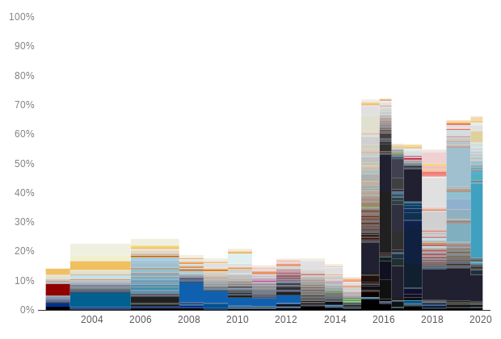

# Website Colors

Visualize how a website's colors changed over time.

Use screenshots from the Internet Archive and plot the data with Datawrapper.

https://blog.datawrapper.de/weekly-chart-website-colors/



## Installation

### Mac

``` shell
$ brew install python geckodriver
$ pip install pipenv
$ make setup
```

### Arch Linux

``` shell
# pacman -S pipenv geckodriver
$ make setup
```

### Other systems

Install these dependencies manually:

- Python >= 3.7
- pipenv
- geckodriver

Then run:

``` shell
$ make setup
```

## Usage

1. Create a new directory for the website color analysis. Example:

    ``` shell
    $ mkdir -p data/BBC
    ```

2. Create a CSV file with the website URL and snapshot dates you wish to
   analyze. Example:

    ``` csv
    # data/BBC/input.csv
    date,url
    2010-02-01,http://news.bbc.co.uk/
    2011-02-01,http://www.bbc.com/news
    ```

    Notice that each date can have a different URL.

3. Run the processing pipeline with arguments specifying the data directory and
   your Datawrapper API Access Token. Example

    ``` shell
    $ ./website-colors \
        --verbose \
        --data-dir="./data" \
        --auth-token="$(secret-tool lookup datawrapper auth-token)"
    ```

    This will take a screenshot of each of the historic snapshots defined in
    `input.csv`, analyze its colors, and create a chart in the [Datawrapper
    App](https://app.datawrapper.de/).

    All intermediate data will be stored in the data directory.

    If the pipeline execution fails anywhere in the process, you can safely
    rerun it and it will continue where it left of.

## Development

### Installation

``` shell
make setup-dev
```

### Testing and linting

``` shell
make test
make lint
```

### Help

``` shell
make help
```

## Contributing

__Feel free to remix this project__ under the terms of the [Apache License,
Version 2.0](http://www.apache.org/licenses/LICENSE-2.0).
